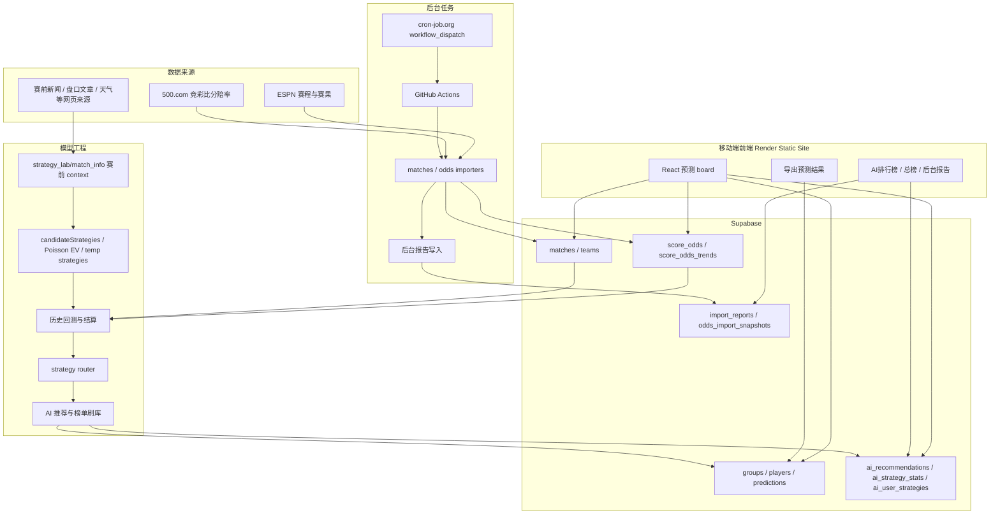

# 世界杯比分预测

一个给微信群用的移动端比分预测工具。群友通过同一个 `?group=` 链接进入各自群空间，选择用户名，为每天比赛多选比分并保存。页面支持导出微信群文本、查看群内统计、查看 AI 推荐和 AI 策略排行榜。

## 核心能力

- 群隔离：不同 `group` URL 完全隔离玩家和预测。
- 赛程真实化：GitHub Actions / 外部 cron 定时拉取比赛状态和赛果。
- 比分赔率：抓取并解析竞彩比分赔率，写入 Supabase。
- 预测收集：每个用户每场可以选多个比分，再次提交会覆盖自己的旧预测。
- 文本传播：一键导出微信群可读的预测结果、今日战报和欢迎预测链接。
- AI 推荐：离线策略、回测、router 共同生成推荐，前端以蓝色星标展示推荐比分。
- 策略实验：本地 strategy lab 支持策略迭代、历史回测、ROI 榜单和赛前 context 管理。

## 架构



## 常用命令

```bash
npm install
npm test
npm run build
```

本地开发：

```bash
npm run dev
```

数据导入：

```bash
npm run import:matches
npm run import:odds
npm run backfill:odds-trends
```

AI 策略与榜单：

```bash
npm run strategy:tem
npm run backtest:candidates
npm run ai:predict-router -- --from=2026-06-26
```

历史 context：

```bash
npm run historical:contexts
npm run prematch:sources
npm run historical:verify
```

## 部署

Render 使用 Static Site：

- Build Command: `npm run build`
- Publish Directory: `dist`
- 环境变量：`VITE_SUPABASE_URL`、`VITE_SUPABASE_ANON_KEY`

GitHub Actions 使用 repository secrets：

- `SUPABASE_URL`
- `SUPABASE_SERVICE_ROLE_KEY`

近实时更新通过 cron-job.org 调 GitHub `workflow_dispatch`，GitHub Actions 自带 schedule 只作为兜底。

## 数据与策略原则

- Supabase 是前端读写的唯一权威状态源。
- 赛前 context 只能包含开赛前可验证的信息；带赛后结果或更新时间晚于开赛的来源只能进入 audit。
- date-only 来源只能在“北京时间赛前一天”进入 `weakContext`。
- 回测和实盘使用同一种策略接口：输入赛前 context 和赔率，输出 `{ score, stake }`。
- ROI 口径：每个比分 1 注，命中返还为该比分赔率，`ROI = (返还 - 成本) / 成本`。
