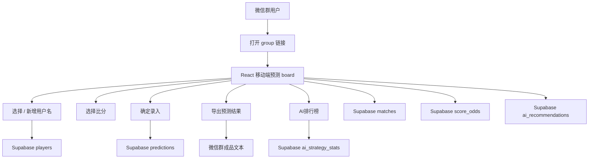
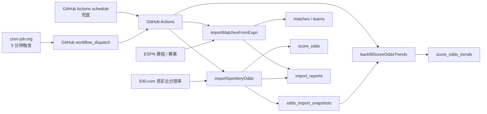
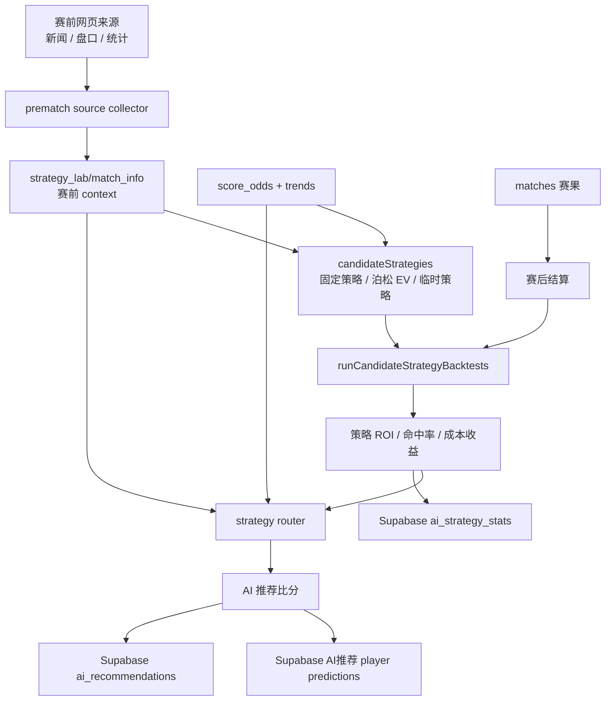

# 世界杯比分预测

一个给微信群玩的世界杯比分预测工具。

每天把群链接发到微信群，大家点开网页，选择自己的名字，给每场比赛选一个或多个比分。比赛结束后，网页可以导出一段适合直接发回微信群的文本：谁命中了、收益多少、下一天还有哪些比赛可以继续预测。

这个项目的乐趣不只是收集比分，还包括赔率、ROI、排行榜，以及一个会不断回测和迭代的 AI 推荐玩家。

## 这东西怎么玩

1. 创建或打开一个群链接，例如 `https://.../?group=abc123`。
2. 群友选择自己的用户名；没有名字就点 `+` 新增。
3. 在当天比赛卡片里选择比分，可以多选。
4. 点 `确定录入` 保存预测。
5. 点 `预测结果` 导出微信群文本。
6. 点 `AI排行榜` 查看当前 AI 策略回测表现；点 `... -> AI策略` 可以提交自己的策略想法。

不同群链接的数据完全隔离。你可以给两个微信群发两个不同链接，它们互不影响。

## 当前功能

- 移动端预测 board，优先适配 iPhone 13 及之后的宽度。
- 用户名和预测持久化到 Supabase。
- 赛程、赛果、比分赔率持续更新。
- 比分选项展示赔率和赔率变化。
- 正确比分、命中结果、ROI、净收益、成本都会进入导出文本。
- AI 推荐以蓝色星标出现在比分选项右上角。
- AI 策略排行榜展示历史 ROI，前三名有明显标记。
- 本地 strategy lab 支持赛前信息收集、策略回测、router 选择和榜单刷新。

## 工程视角

这个项目可以分成三层：

- **前端应用**：让群友预测、保存、导出和查看 AI 信息。
- **数据更新**：把赛程、赛果、赔率、后台报告写入 Supabase。
- **模型工程**：离线收集赛前 context，回测策略，选择 AI 推荐并刷回数据库。

### 1. 前端交互层

这张图只看用户打开网页后发生什么。



前端没有自己的业务数据库。它只负责交互和展示，最终状态以 Supabase 为准。

### 2. 数据更新层

这张图只看“真实比赛数据和赔率怎么进入数据库”。



GitHub Actions 不被当成严格定时器使用；准点更新靠 cron-job.org 调 GitHub 的手动触发接口。Actions 自带 schedule 只是兜底。

### 3. AI 与策略工程层

这张图只看“AI 推荐怎么产生、怎么变强”。



策略研发是离线的。前端不运行模型，只读取已经写入 Supabase 的推荐结果、理由和榜单。

## 关键约束

- 每个 `group` 完全隔离。
- Supabase 是前端状态的唯一权威源。
- 比赛时间和展示日期统一使用北京时间。
- 每个比分按 1 注计算成本。
- ROI = `(返还 - 成本) / 成本`。
- 赛前 context 不能偷看结果；赛后字段只能在结算阶段使用。
- date-only 来源只有在“北京时间赛前一天”才允许进入 `weakContext`。

## 常用命令

```bash
npm install
npm test
npm run build
npm run dev
```

数据更新：

```bash
npm run import:matches
npm run import:odds
npm run backfill:odds-trends
```

AI 策略：

```bash
npm run backtest:candidates
npm run strategy:tem
npm run ai:predict-router -- --from=2026-06-26
```

历史 context：

```bash
npm run historical:contexts
npm run prematch:sources
npm run historical:verify
```

## 部署

Render 使用 Static Site：

- Build Command: `npm run build`
- Publish Directory: `dist`
- 环境变量：`VITE_SUPABASE_URL`、`VITE_SUPABASE_ANON_KEY`

GitHub Actions 使用 repository secrets：

- `SUPABASE_URL`
- `SUPABASE_SERVICE_ROLE_KEY`

Render 只负责托管静态前端，不负责定时任务；定时数据更新由 cron-job.org + GitHub Actions 完成。
