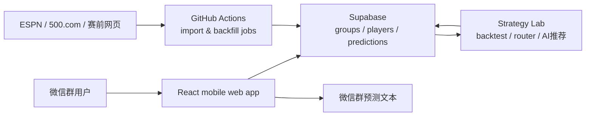

# World Cup Predictor

一个给微信群用的世界杯比分预测与 AI 推荐工具。

群主每天把同一个群链接发到群里，群友打开网页、选择自己的名字、给每场比赛选比分。赛后，工具会自动汇总命中、赔率收益、ROI，并导出一段可以直接发回微信群的文本。项目还内置一个持续回测和迭代的 `AI推荐` 玩家，用赔率、泊松模型和赛前信息生成推荐比分。

| 入口 | 说明 |
| --- | --- |
| `/?group=<group_id>` | 进入一个完全隔离的群预测房间 |
| `预测结果` | 导出微信群成品文本 |
| `AI排行榜` | 查看所有 AI 策略的历史 ROI |
| `... -> AI策略` | 提交新的策略想法，后续可回测和纳入候选 |

## Highlights

- **微信群优先**：移动端第一屏就是比赛 board，适合每天转发、快速填写、快速导出。
- **群数据隔离**：不同 `group_id` 的用户、预测和导出结果互不影响。
- **真实赛程与赔率**：GitHub Actions 拉取赛程、赛果、竞彩比分赔率，并写入 Supabase。
- **波胆玩法完整**：比分选项展示赔率、赔率涨跌、赛果高亮和命中收益。
- **AI 推荐玩家**：AI 推荐以蓝色星标出现在比分选项上，并像普通用户一样进入导出文本。
- **策略实验室**：支持赛前 context 收集、策略回测、router 选择、排行榜刷新和赛后结算。
- **可复现工程流**：测试、构建、截图验收、数据导入和策略预测都有独立脚本。

## How It Works



The frontend is a static React app. It does not own business state; Supabase is the source of truth. Scheduled jobs and local strategy scripts enrich the database with matches, odds, results, AI recommendations, and strategy leaderboard stats.

## User Flow

1. Open a group link, for example `https://worldcup-predictor.example.com/?group=abc123`.
2. Select a username, or add a new one with `+`.
3. Pick one or more exact scores for each match.
4. Submit predictions.
5. After matches finish, open `预测结果` and copy the WeChat-ready result text.
6. Open `AI排行榜` to see which AI strategies have performed best historically.

If the URL does not include `group`, the app shows a simple home page that can generate a new six-character group link.

## AI Recommendation

`AI推荐` is a special system player. It is not selected from the normal user list; instead, its picks are rendered as blue stars on score options.

For each match, the AI detail panel includes:

- **本场摘要**: a short preview under the match title.
- **策略特点**: what kind of strategy was used.
- **Router 选择理由**: why the router selected this strategy for this match.
- **完整说明**: one line per recommended score.

For Poisson/EV strategies, the score explanation uses model numbers instead of vague text:

```text
本场推荐：0-1、0-0
- 0-1：预计概率 10.45%，EV +2.03，赔率 29。
- 0-0：预计概率 10.63%，EV +1.55，赔率 24。
```

`EV = 预计概率 * 赔率 - 1`.

## System Components

### Frontend

- `src/main.jsx`: mobile board, dialogs, export flow, AI detail UI.
- `src/supabaseData.mjs`: Supabase reads/writes and app-shape mapping.
- `src/predictionState.mjs`: local prediction state helpers.
- `src/predictionExport.mjs`: WeChat-ready export text.

### Data Import

- `scripts/importMatchesFromEspn.mjs`: imports schedule, kickoff time, status, and final scores.
- `scripts/importSportteryOdds.mjs`: imports correct-score odds.
- `scripts/backfillScoreOddsTrends.mjs`: computes first-to-latest odds movement.
- `scripts/reportActionFailure.mjs`: writes backend report rows when scheduled jobs fail.

### Strategy Lab

- `src/strategyCandidates.mjs`: deterministic candidate strategies and backtest runner.
- `src/poissonEvStrategy.mjs`: Poisson / Dixon-Coles probability table and EV selection.
- `src/strategyRouter.mjs`: chooses the production AI strategy per match.
- `strategy_lab/match_info/`: collected pre-match context.
- `strategy_lab/predictions/`: generated prediction logs and reports.
- `strategy_lab/skills/`: project-specific operating rules for context, routing, and strategy work.

## Data Model

The app depends on these Supabase tables:

| Table | Purpose |
| --- | --- |
| `groups` | group rooms keyed by URL code |
| `players` | group-local usernames plus `AI推荐` |
| `predictions` | score picks per group, player, and match |
| `matches` | schedule, status, scores, team snapshots |
| `teams` | canonical English/Chinese team names |
| `score_odds` | latest correct-score odds |
| `score_odds_trends` | odds movement from first snapshot to latest snapshot |
| `odds_import_snapshots` | raw odds import audit snapshots |
| `ai_recommendations` | AI strategy, score details, router reason, score explanations |
| `ai_strategy_stats` | leaderboard rows for AI strategies |
| `import_reports` | backend job status shown in the app |

## Getting Started

Requirements:

- Node.js 22+
- Supabase project with the project schema applied
- Optional: GitHub Actions secrets for scheduled imports

Install and run the app:

```bash
npm install
npm run dev
```

Run verification:

```bash
npm test
npm run build
```

Create `.env.local` for local data scripts:

```bash
VITE_SUPABASE_URL=https://<project>.supabase.co
VITE_SUPABASE_ANON_KEY=<publishable-key>
SUPABASE_URL=https://<project>.supabase.co
SUPABASE_SERVICE_ROLE_KEY=<service-role-key>
```

The frontend only needs `VITE_SUPABASE_URL` and `VITE_SUPABASE_ANON_KEY`. Import and AI scripts need `SUPABASE_URL` and `SUPABASE_SERVICE_ROLE_KEY`.

## Common Commands

### App

```bash
npm run dev
npm test
npm run build
```

### Match And Odds Jobs

```bash
npm run import:matches:dry
npm run import:matches

npm run import:odds:dry
npm run import:odds
npm run backfill:odds-trends
```

### AI And Strategy Lab

```bash
npm run backtest:candidates
npm run strategy:tem

npm run ai:predict-router:dry -- --from=2026-06-27
npm run ai:predict-router -- --from=2026-06-27
```

### Prematch Context

```bash
npm run prematch:sources:dry
npm run prematch:sources
npm run historical:contexts
npm run historical:verify
```

## Scheduled Jobs

GitHub Actions has two workflows:

- `Import World Cup Matches`: updates schedule, status, and final scores.
- `Import Sporttery Odds`: updates score odds and odds trends.

The repository also supports external triggering through GitHub `workflow_dispatch`, which lets a service such as cron-job.org call the workflows more regularly than GitHub's native schedule. GitHub's own cron schedule remains a fallback.

Required GitHub repository secrets:

```text
SUPABASE_URL
SUPABASE_SERVICE_ROLE_KEY
```

## Deployment

Render can host the frontend as a Static Site:

```text
Build Command: npm run build
Publish Directory: dist
```

Render environment variables:

```text
VITE_SUPABASE_URL
VITE_SUPABASE_ANON_KEY
```

Render only serves the static frontend. Data imports, odds refreshes, and AI prediction refreshes run through GitHub Actions or local scripts.

## Engineering Rules

- Supabase is the single source of truth for app state.
- Every `group` is fully isolated.
- Match dates and labels are displayed in UTC+8 / Beijing time.
- Each selected score costs 1 unit.
- ROI is `(return - cost) / cost`.
- Pre-match context must not contain post-match result leakage.
- For AI recommendations, router reasons and per-score explanations are separate fields.
- Before shipping meaningful changes, run `npm test` and `npm run build`.

## Project Status

This is a small, real-use product built for a live friend group workflow. It intentionally favors:

- fast mobile input over desktop-heavy dashboards,
- readable WeChat export text over complex reports,
- deterministic scripts over hidden backend services,
- local strategy experimentation before productionizing AI recommendations.

